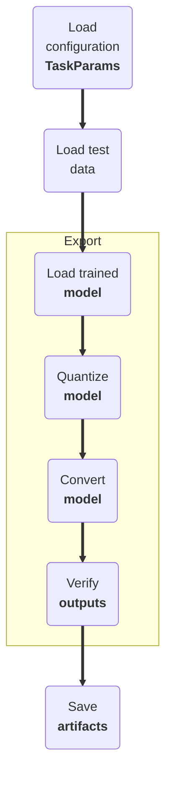

import ConfigExample from "../../../components/ConfigExample.astro";

## Introduction

Export mode is used to convert the trained TensorFlow model into a format that can be used for deployment onto Ambiq's family of SoCs. Currently, the command will convert the TensorFlow model into both TensorFlow Lite (TFL) and TensorFlow Lite for micro-controller (TFLM) variants. The command will also verify the models' outputs match. The activations and weights can be quantized by configuring the `quantization` section in the configuration file or by setting the `quantization` parameter in the code.

<div class="annotate">

1. Load the configuration data (e.g. `configuration.json`)
1. Load the test data (e.g. `test.tfds`)
1. Load the trained model (e.g. `model.keras`)
1. Quantize the model (e.g. `16x8`)
1. Convert the model (e.g. `TFL`, `TFLM`)
1. Verify the models' outputs match
1. Save artifacts (e.g. `model.tflite`)

</div>

**Example configuration**
<ConfigExample code={"{\n    \"name\": \"sd-2-tcn-sm\",\n    \"job_dir\": \"./results/sd-2-tcn-sm\",\n    \"verbose\": 2,\n\n    \"datasets\": [{\n        \"name\": \"cmidss\",\n        \"params\": {\n            \"path\": \"./datasets/cmidss\"\n        }\n    }],\n\n    \"feature\": {\n        \"name\": \"FS-W-A-5\",\n        \"sampling_rate\": 0.2,\n        \"frame_size\": 12,\n        \"loader\": \"hdf5\",\n        \"feat_key\": \"features\",\n        \"label_key\": \"detect_labels\",\n        \"mask_key\": \"mask\",\n        \"feat_cols\": null,\n        \"save_path\": \"./datasets/store/fs-w-a-5-60\",\n        \"params\": {}\n    },\n\n    \"sampling_rate\": 0.0083333,\n    \"frame_size\": 240,\n\n    \"num_classes\": 2,\n    \"class_map\": {\n        \"0\": 0,\n        \"1\": 1,\n        \"2\": 1,\n        \"3\": 1,\n        \"4\": 1,\n        \"5\": 1\n    },\n    \"class_names\": [\"WAKE\", \"SLEEP\"],\n\n    \"samples_per_subject\": 100,\n    \"val_samples_per_subject\": 100,\n    \"test_samples_per_subject\": 50,\n\n    \"val_size\": 4000,\n    \"test_size\": 2500,\n\n    \"val_subjects\": 0.20,\n    \"batch_size\": 128,\n    \"buffer_size\": 10000,\n    \"epochs\": 200,\n    \"steps_per_epoch\": 25,\n    \"val_steps_per_epoch\": 25,\n    \"val_metric\": \"loss\",\n    \"lr_rate\": 1e-3,\n    \"lr_cycles\": 1,\n    \"label_smoothing\": 0,\n\n    \"test_metric\": \"f1\",\n    \"test_metric_threshold\": 0.02,\n    \"tflm_var_name\": \"sk_detect_flatbuffer\",\n    \"tflm_file\": \"sk_detect_flatbuffer.h\",\n\n    \"backend\": \"pc\",\n    \"display_report\": true,\n\n    \"quantization\": {\n        \"qat\": false,\n        \"mode\": \"INT8\",\n        \"io_type\": \"int8\",\n        \"concrete\": true,\n        \"debug\": false\n    },\n\n    \"model_file\": \"model.keras\",\n    \"use_logits\": false,\n    \"architecture\": {\n        \"name\": \"tcn\",\n        \"params\": {\n            \"input_kernel\": [1, 5],\n            \"input_norm\": \"batch\",\n            \"blocks\": [\n                {\"depth\": 1, \"branch\": 1, \"filters\": 16, \"kernel\": [1, 5], \"dilation\": [1, 1], \"dropout\": 0.10, \"ex_ratio\": 1, \"se_ratio\": 4, \"norm\": \"batch\"},\n                {\"depth\": 1, \"branch\": 1, \"filters\": 32, \"kernel\": [1, 5], \"dilation\": [1, 2], \"dropout\": 0.10, \"ex_ratio\": 1, \"se_ratio\": 4, \"norm\": \"batch\"},\n                {\"depth\": 1, \"branch\": 1, \"filters\": 48, \"kernel\": [1, 5], \"dilation\": [1, 4], \"dropout\": 0.10, \"ex_ratio\": 1, \"se_ratio\": 4, \"norm\": \"batch\"},\n                {\"depth\": 1, \"branch\": 1, \"filters\": 64, \"kernel\": [1, 5], \"dilation\": [1, 8], \"dropout\": 0.10, \"ex_ratio\": 1, \"se_ratio\": 4, \"norm\": \"batch\"}\n            ],\n            \"output_kernel\": [1, 5],\n            \"include_top\": true,\n            \"use_logits\": true,\n            \"model_name\": \"tcn\"\n        }\n    }\n}"} lang="json" filename="modes-export-1.json" download="/sleepkit/examples/modes-export-1.json">

```json title="modes-export-1.json"
{
    "name": "sd-2-tcn-sm",
    "job_dir": "./results/sd-2-tcn-sm",
    "verbose": 2,

    "datasets": [{
        "name": "cmidss",
        "params": {
            "path": "./datasets/cmidss"
        }
    }],

    "feature": {
        "name": "FS-W-A-5",
        "sampling_rate": 0.2,
        "frame_size": 12,
        "loader": "hdf5",
        "feat_key": "features",
        "label_key": "detect_labels",
        "mask_key": "mask",
        "feat_cols": null,
        "save_path": "./datasets/store/fs-w-a-5-60",
        "params": {}
    },

    "sampling_rate": 0.0083333,
    "frame_size": 240,

    "num_classes": 2,
    "class_map": {
        "0": 0,
        "1": 1,
        "2": 1,
        "3": 1,
        "4": 1,
        "5": 1
    },
    "class_names": ["WAKE", "SLEEP"],

    "samples_per_subject": 100,
    "val_samples_per_subject": 100,
    "test_samples_per_subject": 50,

    "val_size": 4000,
    "test_size": 2500,

    "val_subjects": 0.20,
    "batch_size": 128,
    "buffer_size": 10000,
    "epochs": 200,
    "steps_per_epoch": 25,
    "val_steps_per_epoch": 25,
    "val_metric": "loss",
    "lr_rate": 1e-3,
    "lr_cycles": 1,
    "label_smoothing": 0,

    "test_metric": "f1",
    "test_metric_threshold": 0.02,
    "tflm_var_name": "sk_detect_flatbuffer",
    "tflm_file": "sk_detect_flatbuffer.h",

    "backend": "pc",
    "display_report": true,

    "quantization": {
        "qat": false,
        "mode": "INT8",
        "io_type": "int8",
        "concrete": true,
        "debug": false
    },

    "model_file": "model.keras",
    "use_logits": false,
    "architecture": {
        "name": "tcn",
        "params": {
            "input_kernel": [1, 5],
            "input_norm": "batch",
            "blocks": [
                {"depth": 1, "branch": 1, "filters": 16, "kernel": [1, 5], "dilation": [1, 1], "dropout": 0.10, "ex_ratio": 1, "se_ratio": 4, "norm": "batch"},
                {"depth": 1, "branch": 1, "filters": 32, "kernel": [1, 5], "dilation": [1, 2], "dropout": 0.10, "ex_ratio": 1, "se_ratio": 4, "norm": "batch"},
                {"depth": 1, "branch": 1, "filters": 48, "kernel": [1, 5], "dilation": [1, 4], "dropout": 0.10, "ex_ratio": 1, "se_ratio": 4, "norm": "batch"},
                {"depth": 1, "branch": 1, "filters": 64, "kernel": [1, 5], "dilation": [1, 8], "dropout": 0.10, "ex_ratio": 1, "se_ratio": 4, "norm": "batch"}
            ],
            "output_kernel": [1, 5],
            "include_top": true,
            "use_logits": true,
            "model_name": "tcn"
        }
    }
}
```

</ConfigExample>



---

## Usage

### CLI

The following command will export a detect model using the reference configuration.

```bash title="Terminal"
sleepkit --task detect --mode export --config ./configuration.json
```

### Python

The model can be exported using the following snippet:

```py title="Python example" linenums="1"
from pathlib import Path
import sleepkit as sk

task = sk.TaskFactory.get("detect")

params = sk.TaskParams.model_validate_json(
    Path("configuration.json").read_text()
)

task.export(params)

```

**Example configuration**
<ConfigExample code={"{\n    \"name\": \"sd-2-tcn-sm\",\n    \"job_dir\": \"./results/sd-2-tcn-sm\",\n    \"verbose\": 2,\n\n    \"datasets\": [{\n        \"name\": \"cmidss\",\n        \"params\": {\n            \"path\": \"./datasets/cmidss\"\n        }\n    }],\n\n    \"feature\": {\n        \"name\": \"FS-W-A-5\",\n        \"sampling_rate\": 0.2,\n        \"frame_size\": 12,\n        \"loader\": \"hdf5\",\n        \"feat_key\": \"features\",\n        \"label_key\": \"detect_labels\",\n        \"mask_key\": \"mask\",\n        \"feat_cols\": null,\n        \"save_path\": \"./datasets/store/fs-w-a-5-60\",\n        \"params\": {}\n    },\n\n    \"sampling_rate\": 0.0083333,\n    \"frame_size\": 240,\n\n    \"num_classes\": 2,\n    \"class_map\": {\n        \"0\": 0,\n        \"1\": 1,\n        \"2\": 1,\n        \"3\": 1,\n        \"4\": 1,\n        \"5\": 1\n    },\n    \"class_names\": [\"WAKE\", \"SLEEP\"],\n\n    \"samples_per_subject\": 100,\n    \"val_samples_per_subject\": 100,\n    \"test_samples_per_subject\": 50,\n\n    \"val_size\": 4000,\n    \"test_size\": 2500,\n\n    \"val_subjects\": 0.20,\n    \"batch_size\": 128,\n    \"buffer_size\": 10000,\n    \"epochs\": 200,\n    \"steps_per_epoch\": 25,\n    \"val_steps_per_epoch\": 25,\n    \"val_metric\": \"loss\",\n    \"lr_rate\": 1e-3,\n    \"lr_cycles\": 1,\n    \"label_smoothing\": 0,\n\n    \"test_metric\": \"f1\",\n    \"test_metric_threshold\": 0.02,\n    \"tflm_var_name\": \"sk_detect_flatbuffer\",\n    \"tflm_file\": \"sk_detect_flatbuffer.h\",\n\n    \"backend\": \"pc\",\n    \"display_report\": true,\n\n    \"quantization\": {\n        \"qat\": false,\n        \"mode\": \"INT8\",\n        \"io_type\": \"int8\",\n        \"concrete\": true,\n        \"debug\": false\n    },\n\n    \"model_file\": \"model.keras\",\n    \"use_logits\": false,\n    \"architecture\": {\n        \"name\": \"tcn\",\n        \"params\": {\n            \"input_kernel\": [1, 5],\n            \"input_norm\": \"batch\",\n            \"blocks\": [\n                {\"depth\": 1, \"branch\": 1, \"filters\": 16, \"kernel\": [1, 5], \"dilation\": [1, 1], \"dropout\": 0.10, \"ex_ratio\": 1, \"se_ratio\": 4, \"norm\": \"batch\"},\n                {\"depth\": 1, \"branch\": 1, \"filters\": 32, \"kernel\": [1, 5], \"dilation\": [1, 2], \"dropout\": 0.10, \"ex_ratio\": 1, \"se_ratio\": 4, \"norm\": \"batch\"},\n                {\"depth\": 1, \"branch\": 1, \"filters\": 48, \"kernel\": [1, 5], \"dilation\": [1, 4], \"dropout\": 0.10, \"ex_ratio\": 1, \"se_ratio\": 4, \"norm\": \"batch\"},\n                {\"depth\": 1, \"branch\": 1, \"filters\": 64, \"kernel\": [1, 5], \"dilation\": [1, 8], \"dropout\": 0.10, \"ex_ratio\": 1, \"se_ratio\": 4, \"norm\": \"batch\"}\n            ],\n            \"output_kernel\": [1, 5],\n            \"include_top\": true,\n            \"use_logits\": true,\n            \"model_name\": \"tcn\"\n        }\n    }\n}"} lang="json" filename="modes-export-4.json" download="/sleepkit/examples/modes-export-4.json">

```json title="modes-export-4.json"
{
    "name": "sd-2-tcn-sm",
    "job_dir": "./results/sd-2-tcn-sm",
    "verbose": 2,

    "datasets": [{
        "name": "cmidss",
        "params": {
            "path": "./datasets/cmidss"
        }
    }],

    "feature": {
        "name": "FS-W-A-5",
        "sampling_rate": 0.2,
        "frame_size": 12,
        "loader": "hdf5",
        "feat_key": "features",
        "label_key": "detect_labels",
        "mask_key": "mask",
        "feat_cols": null,
        "save_path": "./datasets/store/fs-w-a-5-60",
        "params": {}
    },

    "sampling_rate": 0.0083333,
    "frame_size": 240,

    "num_classes": 2,
    "class_map": {
        "0": 0,
        "1": 1,
        "2": 1,
        "3": 1,
        "4": 1,
        "5": 1
    },
    "class_names": ["WAKE", "SLEEP"],

    "samples_per_subject": 100,
    "val_samples_per_subject": 100,
    "test_samples_per_subject": 50,

    "val_size": 4000,
    "test_size": 2500,

    "val_subjects": 0.20,
    "batch_size": 128,
    "buffer_size": 10000,
    "epochs": 200,
    "steps_per_epoch": 25,
    "val_steps_per_epoch": 25,
    "val_metric": "loss",
    "lr_rate": 1e-3,
    "lr_cycles": 1,
    "label_smoothing": 0,

    "test_metric": "f1",
    "test_metric_threshold": 0.02,
    "tflm_var_name": "sk_detect_flatbuffer",
    "tflm_file": "sk_detect_flatbuffer.h",

    "backend": "pc",
    "display_report": true,

    "quantization": {
        "qat": false,
        "mode": "INT8",
        "io_type": "int8",
        "concrete": true,
        "debug": false
    },

    "model_file": "model.keras",
    "use_logits": false,
    "architecture": {
        "name": "tcn",
        "params": {
            "input_kernel": [1, 5],
            "input_norm": "batch",
            "blocks": [
                {"depth": 1, "branch": 1, "filters": 16, "kernel": [1, 5], "dilation": [1, 1], "dropout": 0.10, "ex_ratio": 1, "se_ratio": 4, "norm": "batch"},
                {"depth": 1, "branch": 1, "filters": 32, "kernel": [1, 5], "dilation": [1, 2], "dropout": 0.10, "ex_ratio": 1, "se_ratio": 4, "norm": "batch"},
                {"depth": 1, "branch": 1, "filters": 48, "kernel": [1, 5], "dilation": [1, 4], "dropout": 0.10, "ex_ratio": 1, "se_ratio": 4, "norm": "batch"},
                {"depth": 1, "branch": 1, "filters": 64, "kernel": [1, 5], "dilation": [1, 8], "dropout": 0.10, "ex_ratio": 1, "se_ratio": 4, "norm": "batch"}
            ],
            "output_kernel": [1, 5],
            "include_top": true,
            "use_logits": true,
            "model_name": "tcn"
        }
    }
}
```

</ConfigExample>

---

## Arguments

Please refer to [TaskParams](/sleepkit/modes/configuration/#taskparams) for the list of arguments that can be used with the `export` command.

---
