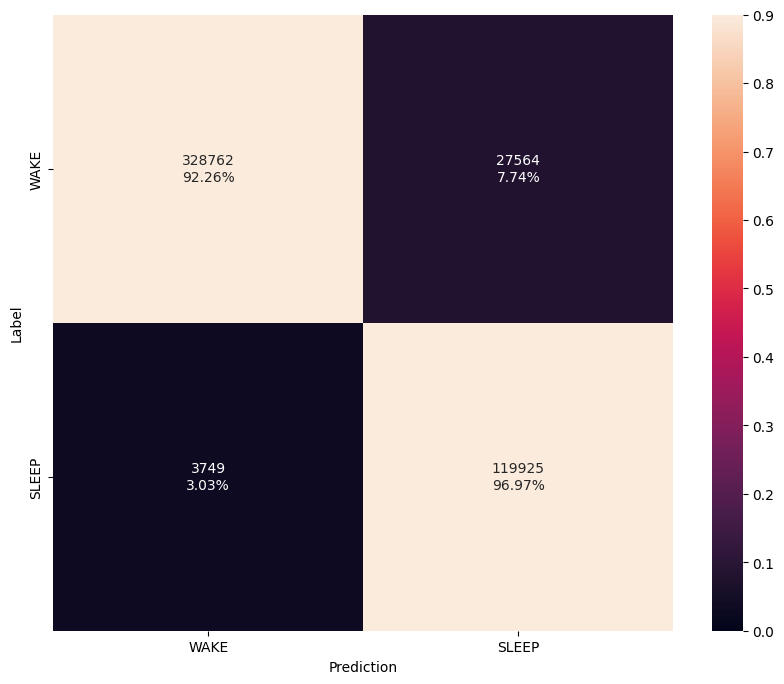

# Results

The following table provides the latest performance and accuracy results of the reference models.

| Task           | Params   | FLOPS    | Accuracy  | F1       | AP        |
| -------------- | -------- | -------- | --------- | -------- | --------- |
| Sleep Detect   | 6K       | 425K/hr  | 94.0%     | 94.2%    | 92.5%     |

## <span class="sk-h2-span">Confusion Matrix</span>

{ width="480" }

## <span class="sk-h2-span">Sleep Efficiency Plot</span>

<div class="sk-plotly-graph-div">
--8<-- "assets/detect-2-eff.html"
</div>

## <span class="sk-h2-span">Total Sleep Time (TST) Plot</span>

<div class="sk-plotly-graph-div">
--8<-- "assets/detect-2-tst.html"
</div>

---

## <span class="sk-h2-span">EVB Performance</span>

The following table provides the latest performance and accuracy results of all models when running on Apollo4 Plus EVB. These results are obtained using neuralSPOTs [Autodeploy tool](https://ambiqai.github.io/neuralSPOT/docs/From%20TF%20to%20EVB%20-%20testing%2C%20profiling%2C%20and%20deploying%20AI%20models.html). From neuralSPOT repo, the following command can be used to capture EVB results via Autodeploy:

``` console
python -m ns_autodeploy \
--tflite-filename sleep-detect-model.tflite \
--model-name sleepdetect \
--cpu-mode 192 \
--arena-size-scratch-buffer-padding 0 \
--max-arena-size 60 \

```

| Task           | Params   | FLOPS   | Metric     | Cycles   | Time    | Arena | NVM   | RAM   |
| -------------- | -------- | ------- | ---------- | -------- | ------- | ----- | ----- | ----- |
| Sleep Detect   | 6K       | 425K/hr | 92.5% AP   |  7.3M/hr | 38ms/hr |  38KB | 208KB |  57KB |
