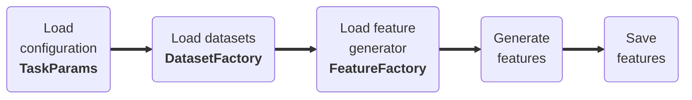

# :simple-chartdotjs: Features

__sleepKIT__ includes a mini _feature store_ to enable crafting rich feature sets to train and evaluate models. The store includes several built-in feature set generators that can be invoked to create feature sets for a variety of use cases. Each feature set inherits from `sk.FeatureSet` and provides implementations for generating features from the dataset.

The main method, `generate_subject_features` receives the target dataset name, subject id, and high-level `sk.TaskParams` which includes field `feature` which includes feature set specific parameters. The resulting data and labels are stored in HDF5 format that can then be used for training via `sk.H5Dataloader` class. Custom feature set generators can also be added to the feature store by subclassing `sk.FeatureSet` and registering the new generator with the feature store.

1. Load the configuration data (e.g. `configuration.json` (1))
1. Load datasets from DatasetFactory (e.g. `mesa`)
1. Load feature generator from FeatureFactory (e.g. `FS-W-PA-14`)
1. Generate features for each dataset/subject (e.g. `generate_subject_features`)
1. Save subjects features to disk (e.g. `subject.h5`)

1. Example configuration:
--8<-- "assets/usage/json-configuration.md"

 

---

## Availabel Feature Sets

- **[FS-W-PA-14](./fs_w_pa_14.md)**:__14__ features derived from __PPG__ and __IMU__ on __wrist__ for __sleep stage__ classification.
- **[FS-C-EAR-9](./fs_c_ear_9.md)**: __9__ features derived from __ECG__, __RSP__, and __IMU__ on __chest__ for __sleep stage__ classification.
- **[FS-W-A-5](./fs_w_a_5.md)**: __5__ features derived from __IMU__ on __wrist__ for actigraphy style __sleep detection__.
- **[FS-H-E-10](./fs_h_e_10.md)**: __10__ features derived from __ECG__ and __EOG__ on __head__ for __sleep stage__ classification.
- **[FS-W-P-5](./fs_w_p_5.md)**: __5__ features derived from __PPG__ on __wrist__ for __sleep apnea__ classification.
- **[BYOFS](./byofs.md)**: Bring-Your-Own-Feature-Set (BYOFS) to create custom feature sets.

## Feature Factory

The feature factory, `sk.FeatureFactory`, provides a convenient way to access the feature sets. The factory is a thread-safe singleton class that provides a single point of access to the features via the features' slug names. The benefit of using the factory is it allows registering new additional feature sets that can then be leveraged by existing and new tasks.

The feature factory provides the following methods:

* **sk.FeatureFactory.register**: Register a custom feature set
* **sk.FeatureFactory.unregister**: Unregister a custom feature set
* **sk.FeatureFactory.has**: Check if a feature set is registered
* **sk.FeatureFactory.get**: Get a feature set
* **sk.FeatureFactory.list**: List all available feature sets
