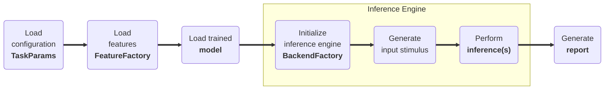

# :material-hexagon-multiple: Task-Level Model Demo

## <span class="sk-h2-span">Introduction </span>

Each task in SleepKit has a corresponding demo mode that allows you to run a task-level demonstration using the specified backend inference engine (e.g. PC or EVB). This is useful to showcase the model's performance in real-time and to verify its accuracy in a real-world scenario. Similar to other modes, the demo can be invoked either via CLI or within `sleepkit` python package. At a high level, the demo mode performs the following actions based on the provided configuration parameters:

1. Load the configuration data (e.g. `configuration.json`)
1. Load the desired features (e.g. `FS-W-A-5`)
1. Load the trained model (e.g. `model.keras`)
1. Initialize inference engine backend (e.g. `pc` or `evb`)
1. Generate input data (e.g. `x, y`)
1. Perform inference on backend (e.g. `model.predict`)
1. Generate report (e.g. `report.html`)



---

## <span class="sk-h2-span">Inference Backends</span>

SleepKit includes two built-in backend inference engines: PC and EVB. Additional backends can be easily added to the SleepKit framework by creating a new backend class and registering it to the backend factory.

### PC Backend

The PC backend is used to run the task-level demo on the local machine. This is useful for quick testing and debugging of the model.

1. Create / modify configuration file (e.g. `stage-class-4.json`)
1. Ensure "pc" is selected as the backend in configuration file.
1. Run demo `sleepkit --mode demo --task stage --config ./configs/stage-class-4.json`
1. HTML report will be saved to `${job_dir}/report.html`

### EVB Backend

The EVB backend is used to run the task-level demo on an Ambiq EVB. This is useful to showcase the model's performance in real-time and to verify its accuracy in a real-world scenario.

1. Create / modify configuration file (e.g. `stage-class-2.json`)
1. Ensure "evb" is selected as the backend in configuration file.
1. Plug EVB into PC via two USB-C cables.
1. Build and flash firmware to EVB `cd evb && make && make deploy`
1. Run demo `sleepkit --mode demo --task beat --config ./configs/stage-class-4.json`
1. HTML report will be saved to `${job_dir}/report.html`

### Bring-Your-Own-Backend

Similar to datasets, tasks, and models, the demo mode can be customized to use your own backend inference engine. SleepKit includes a backend factory (`BackendFactory`) that is used to create and run the backend engine.

#### How it Works

1. **Create a Backend**: Define a new backend class that inherits from the `sk.InferenceBackend` base class and implements the required methods.

    ```py linenums="1"
    import sleepkit as sk

    class CustomBackend(sk.InferenceBackend):
        def __init__(self, params: TaskParams) -> None:
            self.params = params

        def open(self):
            pass

        def close(self):
            pass

        def set_inputs(self, inputs: npt.NDArray):
            pass

        def perform_inference(self):
            pass

        def get_outputs(self) -> npt.NDArray:
            pass
    ```

2. **Register the Backend**: Register the new backend with the `sk.BackendFactory` by calling the `register` method. This method takes the backend name and the backend class as arguments.

    ```py linenums="1"
    import sleepkit as sk
    sk.BackendFactory.register("custom", CustomBackend)
    ```

3. **Use the Backend**: The new backend can now be used by setting the `backend` flag in the demo configuration settings.

    ```py linenums="1"
    import sleepkit as sk

    params = sk.TaskParams(
        ...,
        backend="custom"
    )

    task = sk.TaskFactory.get("detect")

    task.demo(params)
    ```

    _OR_ by creating the backend directly:

    ```py linenums="1"
    import sleepkit as sk

    params = sk.TaskParams(
        ...,
        backend="custom"
    )

    backend = sk.BackendFactory.get("custom")(params)

    ```

---

## <span class="sk-h2-span">Usage </span>

The following is an example of a task-level demo report for the sleep staging task.

=== "CLI"

    ```bash
    sleepkit -m export -t stage -c ./configuration.json
    ```

=== "Python"

    ```py linenums="1"
    from pathlib import Path
    import sleepkit as sk

    task = sk.TaskFactory.get("stage")
    task.export(sk.TaskParams(
        ...
    ))
    ```

<div class="sk-plotly-graph-div">
--8<-- "assets/zoo/stage/sleep-stage-demo.html"
</div>

---

## <span class="sk-h2-span">Arguments </span>

Please refer to [TaskParams](../modes/configuration.md#taskparams) for the list of arguments that can be used with the `demo` command.

---
