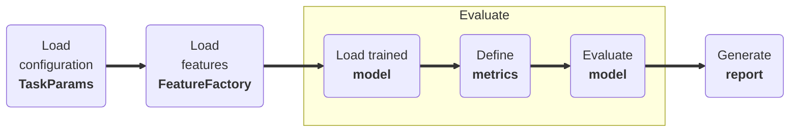

# :material-ab-testing: Model Evaluation

## Introduction 

Evaluate mode is used to test the performance of the model on the reserved test set for the specified task. Similar to training, the routine can be customized via CLI configuration file or by setting the parameters directly in the code. The evaluation process involves testing the model's performance on the test data to measure its accuracy, precision, recall, and F1 score. A number of results and metrics will be generated and saved to the `job_dir`.

<div class="annotate" markdown>

1. Load the configuration data (e.g. `configuration.json` (1))
1. Load features (e.g. `FS-W-A-5`)
1. Load the trained model (e.g. `model.keras`)
1. Define the metrics (e.g. `accuracy`)
1. Evaluate the model (e.g. `model.evaluate`)
1. Generate evaluation report (e.g. `report.json`)

</div>

1. Example configuration:
--8<-- "assets/usage/json-configuration.md"




---

## Usage

### CLI

The following command will evaluate a detect model using the reference configuration.

```bash
sleepkit --task detect --mode evaluate --config ./configuration.json
```

### Python

The model can be evaluated using the following snippet:

```py linenums="1"
import sleepkit as sk

task = sk.TaskFactory.get("detect")

params = sk.TaskParams(...)  # (1)

task.evaluate(params)

```

1. Example configuration:
--8<-- "assets/usage/python-configuration.md"

---

## Arguments 

Please refer to [TaskParams](../modes/configuration.md#taskparams) for the list of arguments that can be used with the `evaluate` command.

---
