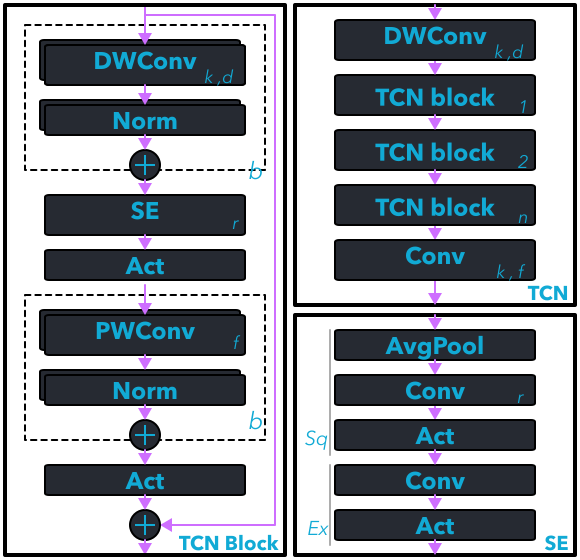

# Model Architecture

For sleep stage classification, we leverage a modified Temporal Convolutional Network (TCN) architecture. During preliminary exploration we also tried various 1-D CNN, RNN (LSTM and GRU), and U-NET based architectures but found them to either require too much memory, computation, or suffer significant accuracy degredation when quantizing to 8-bit.
<!-- Please refer to [Experiments](./experiments.md) for more details on architecture exploration. -->

The below diagram shows the full TCN model architecture for sleep stage classification. The top-level block diagram is depicted in _TCN_ and consists of an input convolutional encoder, a series of _TCN blocks_, and lastly an output convolutional layer. The vanilla TCN architecture consists of several TCN blocks with each block consisting of 2 sequential dilated 1-D convolutional layers followed by a residual connection. Each convolutional layer is followed by weight normalization and ReLU layers.  In our implementation, we replace the first convolutional layer with a depthwise convolutional layer and the second convolutional layer with a pointwise convolutional layer (w/o dilation) as shown in _TCN Block_.  We also added a squeeze and excitation (SE) block between the convolutional layers to emphasize specific channels, depicted in _SE Block_. In place of weight normalization we use standard batch normalization to enable fusing them after training. ReLU is also replaced with the approximated ReLU6. We employ over-parameterization by introducing parallel branches for each convolutional and normalization layers as described in [Vasu et al., 2023](https://doi.org/10.48550/arXiv.2206.04040). Post-training, these parallel branches are fused to create a single branch, thus, imposing no added computation or memory at inference time.

<figure markdown>
  { width="480" }
  <figcaption>Modified TCN Architecture. Conv=Convolutional, DWConv=depthwise convolutional, PWConv=pointwise convolutional, Norm=Normalization, DWConv.k= kernel size, DWConv.d=dilation rate, Conv.k=kernel size, Conv.f= filter size </figcaption>
</figure>
