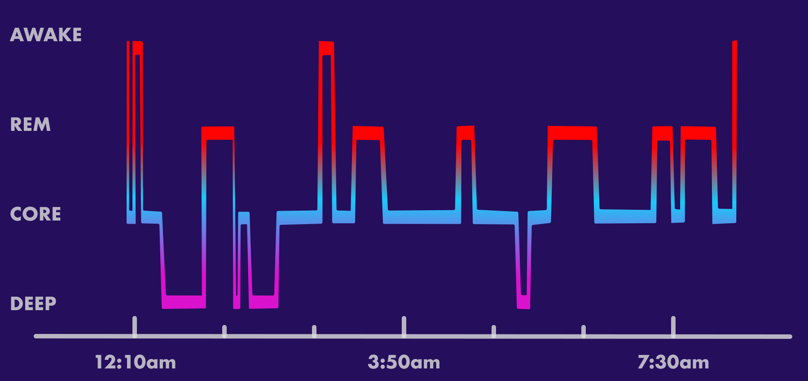

# Sleep Stage Assessment

Sleep stage classification is the process of determining the stage of sleep based on physiological signals. The most common method for sleep stage classification is polysomnography (PSG). A PSG study typically involves monitoring numerous physiological signals including EEG, EOG, EMG, ECG, airflow, respiratory effort, oxygen saturation, body position, snoring, and limb movements. Based on these signals, the sleep stage is determined by a trained sleep technician. The following figure shows an example of a PSG study.

<figure markdown>
  { width="640" }
  <figcaption>Sleep Stage Assessment</figcaption>
</figure>

A total of 101 publications were retrieved; 11 satisfied the selection criteria. The Cohen’s kappa for manual, overall sleep scoring was 0.76, indicating substantial agreement (95% confidence interval, 0.71–0.81; P < .001). By sleep stage, the figures were 0.70, 0.24, 0.57, 0.57, and 0.69 for the W, N1, N2, N3, and R stages, respectively. The interrater reliabilities for stage N2 and N3 sleep were moderate, and that for stage N1 sleep was only fair.

Stage 3/4 (N3)

* 5-6 DELTA waves ( < 2 Hz, 75 uV, 0.5 - 2 sec), no eye movement
* May / may not have sleep spindles / k complexes (no arousals)

REM (REM5)

* EEG similar to N1 (may see sawtooth waves appearing as notched waves in theta range)
* EOG shows burst of rapid eye movement (density increases with sleep )
