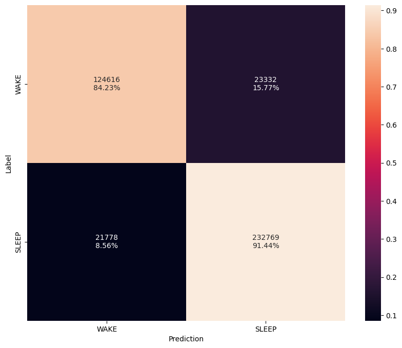
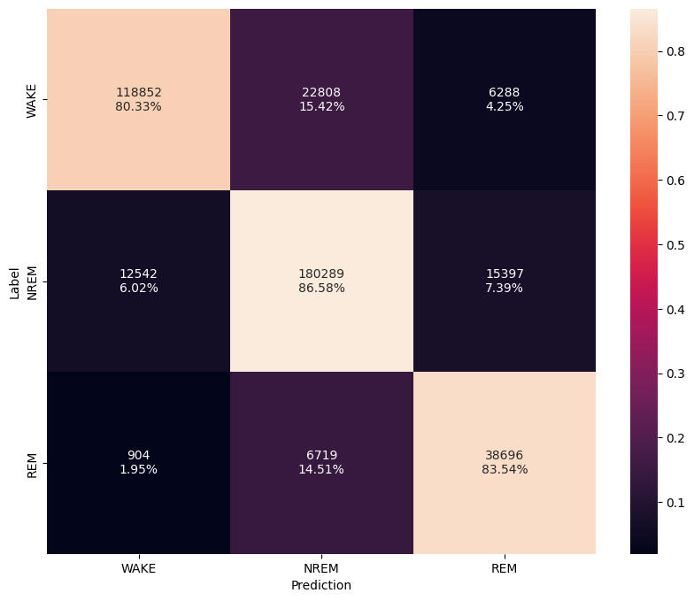
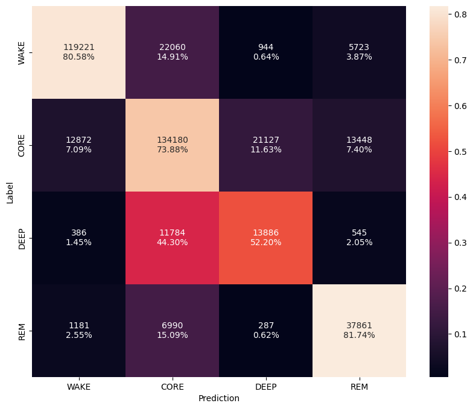
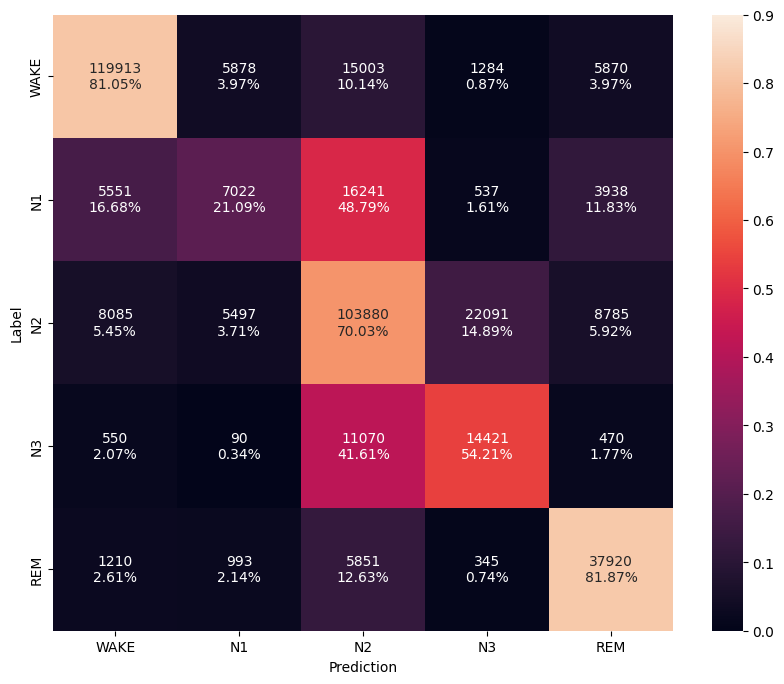

# Results

| Task           | Params   | FLOPS    | Accuracy  | F1       | AP        |
| -------------- | -------- | -------- | --------- | -------- | --------- |
| 2-Stage Sleep  | 10K      | 1.7M/hr  | 88.8%     | 88.8%    | 96.2%     |
| 3-Stage Sleep  | 14K      | 2.2M/hr  | 83.9%     | 84.2%    | 91.5%     |
| 4-Stage Sleep  | 14K      | 2.3M/hr  | 75.8%     | 76.4%    | 83.1%     |
| 5-Stage Sleep  | 17K      | 2.8M/hr  | 70.4%     | 70.2%    | 76.4%     |

## Confusion Matrices

### 2-Stage Sleep Classification

<figure markdown>
  { width="540" }
  <figcaption>2-Stage Sleep Classification CM</figcaption>
</figure>

### 3-Stage Sleep Classification

<figure markdown>
  { width="540" }
  <figcaption>3-Stage Sleep Classification CM</figcaption>
</figure>

### 4-Stage Sleep Classification

<figure markdown>
  { width="540" }
  <figcaption>4-Stage Sleep Classification CM</figcaption>
</figure>

### 5-Stage Sleep Classification

<figure markdown>
  { width="540" }
  <figcaption>5-Stage Sleep Classification CM</figcaption>
</figure>

### Sleep Efficiency Plot

--8<-- "assets/stage-2-eff.html"

### Total Sleep Time (TST) Plot

--8<-- "assets/stage-2-tst.html"

## Comparison

Compare to off-the-shelf models and results (accuracy, memory, computation)

### 3-Stage Sleep Classification (MESA)

| Reference         | Acc       | F1        | WAKE      | NREM      | REM       |
| ----------------- | --------- | --------- | --------- | --------- | --------- |
| [Song et al., 2023](https://doi.org/10.1371/journal.pone.0285703) | 79.1      | 80.0      | 78.0      | 81.8      | 70.9      |
| **SleepKit**      | **83.9**  | **84.2**  | **80.3**  | **86.6**  | **83.5**  |

### 4-Stage Sleep Classification (MESA)

| Reference         | Acc       | F1        | WAKE      | CORE      | DEEP      | REM       |
| ----------------- | --------- | --------- | --------- | --------- | --------- | --------- |
| [Song et al., 2023](https://doi.org/10.1371/journal.pone.0285703) | 70.0      | 72.0      | 78.7      | 66.3      | 55.9      | 63.0      |
| SleepKit          | **75.8**  | **76.4**  | **80.6**  | **73.9**  | **52.2**  | **81.7**  |
