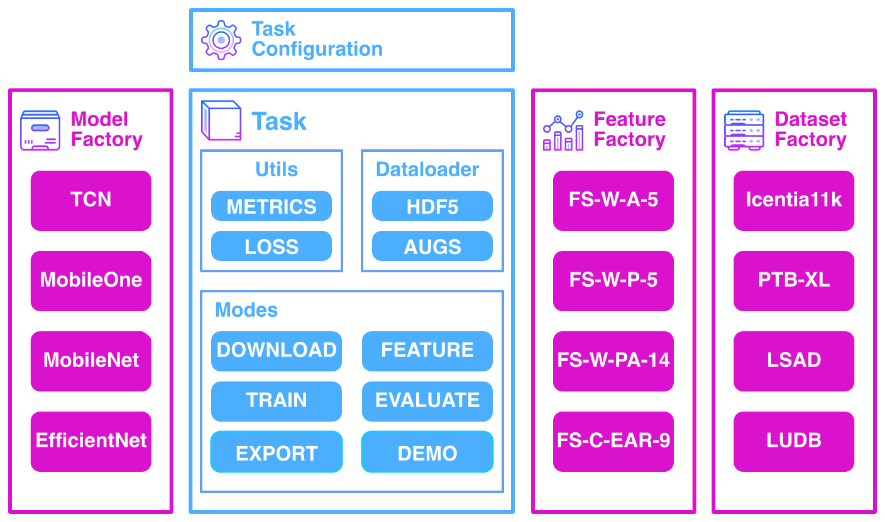

# :simple-task: Tasks

## Introduction

sleepKIT provides several built-in __sleep-monitoring__ related tasks. Each task is designed to address a unique aspect such as sleep staging and sleep apnea detection. The tasks are designed to be modular and can be used independently or in combination to address specific use cases. In addition to the built-in tasks, custom tasks can be created by extending the `sk.Task` base class and registering it with the task factory.

<figure markdown="span">
  { width="600" }
</figure>

---

## Available Tasks

###  [Detect](./detect.md)

Sleep detection is the process of identifying sustained sleep/inactivity bouts. This task is useful for identifying long-term sleep patterns and for monitoring sleep quality.

### [Stage](./stage.md)

Sleep stage classification is the process of identifying the different stages of sleep such as light, deep, and REM sleep. This task is useful for monitoring sleep quality and for identifying sleep disorders.

### [Apnea](./apnea.md)

Sleep apnea detection is the process of identifying hypopnea/apnea events. This task is useful for identifying sleep disorders and for monitoring sleep quality.

<!-- ### [Arousal](./arousal.md)

Sleep arousal detection is the process of identifying sleep arousal events. This task is useful for identifying sleep disorders and for monitoring sleep quality. -->

### [Bring-Your-Own-Task (BYOT)](./byot.md)

Bring-Your-Own-Task (BYOT) is a feature that allows users to create custom tasks by extending the `sk.Task` base class and registering it with the task factory. This feature is useful for addressing specific use cases that are not covered by the built-in tasks.
