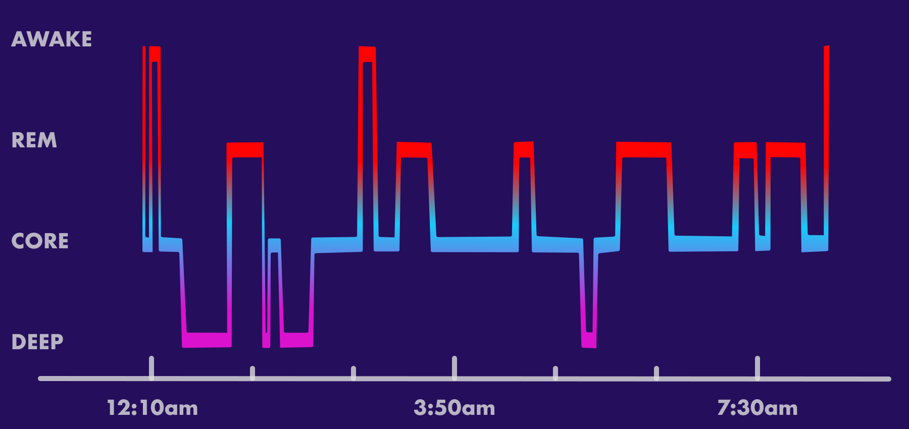

# :material-sleep: Sleep Stage Task

## <span class="sk-h2-span">Overview</span>

The objective of sleep stage assessment is to determine the different stages of sleep (N1, N2, N3, REM, and wake) over the course of a night. The de facto standard for sleep stage assessment is polysomnography (PSG) that requires collecting numerous multi-site physiological signals and a trained sleep technician to perform the assessment. The technician uses the physiological signals to determine the sleep stage based on the American Academy of Sleep Medicine (AASM) guidelines. The identification of stages is possible due to specific electrophysiological signatures present and recorded by EEG, EOG, and EMG signals.

<figure markdown>
  { width="640" }
  <figcaption>Sleep Stage Assessment</figcaption>
</figure>


The focus of this project is to develop a model that can perform sleep stage assessment using only a small subset of the signals that can be captured from same body location (e.g. wrist) that is viable for long-term use. In particular, the current models are trained on physiological signals that can be captured from the wrist for fitness band and smartwatch applications. Traditionally, wrist-based sleep classification has been performed using actigraphy, which is a method of monitoring gross motor activity using an accelerometer. However, actigraphy is not a reliable method for sleep stage assessment. The current model is designed to perform sleep stage assessment using a combination of motor activity, cardiovascular signals (e.g. heart rate), and derived resipiratory signals (e.g. respiration rate).

<figure markdown>
  { width="540" }
  <figcaption>Wrist-based Sleep Classification</figcaption>
</figure>

---

## <span class="sk-h2-span">Sleep Stages</span>

Sleep stages consists of wake (W), non-rapid eye movement (NREM) sleep, and rapid eye movement (REM) sleep. NREM sleep is further divided into three stages: N1, N2, and N3. N1 and N2 are considered light sleep, while N3 is considered deep sleep. REM sleep is considered the dreaming stage of sleep. During the course of a night, a subject will undergo multiple rounds of sleep cycles, each composed of the individual stages. The duration of each cycle and length of each stage various throughout the night. Each sleep cycle typically lasts around 90 to 120 minutes.

--8<-- "assets/tasks/stage/sleep-cycle-pie.html"

=== "Wake (W)"

    This is the time before or after bed when individual is awake.

    Key Characteristics

    * Alpha waves on the EEG
    * No K-complexes or sleep spindles
    * Eye movements are normal
    * Respiratory rate and heart rate are normal
    * Body movements are common

=== "Light Sleep (N1)"

    This is the shortest and lightest stage of sleep. It is the transition from wakefulness to sleep. It is characterized by slow eye movements, and alpha and theta waves on the EEG. It is also known as somnolence, or drowsy sleep. This stage lasts around 1 to 5 minutes, consisting of 5% of total sleep time. This stage is extremely difficult by EEG alone, and is often misclassified as wake or N2.

    Key Characteristics:

    * Alpha and theta waves on the EEG
    * No K-complexes or sleep spindles
    * Slow eye movements
    * Respiratory rate and heart rate are normal
    * Body temperature begins to drop
    * Muscles relax; might jerk

=== "Core Sleep (N2)"

    This stage represents deeper sleep as the body begins to prepare for deep sleep. Physiologically, the body temperature begins to drop and the heart rate begins to slow. The stage is characterized by sleep spindles and K-complexes on the EEG. Stage 2 sleep lasts around 10 to 25 minutes, consisting of 45% to 55% of total sleep time. The duration increases as the night progresses.

    Key Characteristics:

    * Sleep spindles and K-complexes on the EEG
    * No eye movements
    * Respiratory rate and heart rate slows
    * Body temperature drops
    * Body movements are rare

=== "Deep Sleep (N3)"

    Stage 3 sleep is the deepest stage of sleep. It is characterized by delta waves on the EEG. It is also known as slow-wave sleep (SWS) or delta sleep. It is difficult to wake someone from this stage. Stage 3 sleep lasts around 20 to 40 minutes, consisting of 3% to 8% of total sleep time. The duration decreases as the night progresses.

    Key Characteristics:

    * Delta waves on the EEG
    * No eye movements
    * Blood pressure drops, flow increases
    * Respiratory rate and heart rate are at lowest levels
    * Body movements are rare (sleep walking, sleep talking, bed wetting, and night terrors may occur)

=== "REM Sleep (REM)"

    The REM stage is characterized by rapid eye movements, low muscle tone, and dreaming. It is also known as paradoxical sleep. It is difficult to wake someone from this stage. REM sleep lasts around 10 to 60 minutes, consisting of 20% to 25% of total sleep time. The duration increases as the night progresses.

    * Brain activity mimicks normal awake
    * Rapid eye movements
    * Respiration increases and irregular
    * Heart rate increases
    * Temperature regulation is off
    * Body becomes immobile

---

## <span class="sk-h2-span">Model Zoo</span>

The following table provides the latest performance and accuracy results for pre-trained models. Additional result details can be found in [Model Zoo → Stage](../zoo/stage.md).


--8<-- "assets/zoo/stage/stage-model-zoo-table.md"

---

## <span class="sk-h2-span">Target Classes</span>

Below outlines the classes available for sleep stage classification. When training a model, the number of classes, mapping, and names must be provided.

--8<-- "assets/tasks/stage/stage-default-class-table.md"

!!! example "Class Mapping"

    Below is an example of a class mapping for a 4-class sleep stage model. The class map keys are the original class labels and the values are the new class labels. Any class not included will be skipped.

    ```json
    {
        "num_classes": 4,
        "class_names": ["AWAKE", "LIGHT", "DEEP", "REM"],
        "class_map": {
            "0": 0,  // Map WAKE to WAKE
            "1": 1,  // Map STAGE1 to LIGHT
            "2": 1,  // Map STAGE2 to LIGHT
            "3": 2,  // Map STAGE3 to DEEP
            "4": 2,  // Map STAGE4 to DEEP
            "5": 3,  // Map REM to REM
        }
    }
    ```

---

## <span class="sk-h2-span">Limitations</span>

Inferring sleep stage without electrophysiological signals is an extremely challenging task. Especially when considering a highly noisy ambulatory environment. Furthermore, the limited time spent in certain sleep stages such as N1 makes it difficult to accurately classify these stages. This is highlighted by the limited interrater reliability of sleep stage scoring. A recent paper by [Kapur et al., 2021](https://doi.org/10.5664/jcsm.9538) performed a meta-analysis of 101 studies and found that the interrater reliability for stage N1 sleep was only fair, while the interrater reliabilities for stage N2 and N3 sleep were moderate. The paper found the Cohen’s kappa for manual, overall sleep scoring was 0.76, indicating substantial agreement (95% confidence interval, 0.71–0.81; P < .001). By sleep stage, the figures were 0.70, 0.24, 0.57, 0.57, and 0.69 for the W, N1, N2, N3, and R stages, respectively. The interrater reliabilities for stage N2 and N3 sleep were moderate, and that for stage N1 sleep was only fair. Taking this into account, we should not expect to achieve perfect sleep stage classification.


## <span class="sk-h2-span">References</span>

* [U-Sleep: Resilient High-Frequency Sleep Staging](https://doi.org/10.1038/s41746-021-00440-5)
* [U-Time: A Fully Convolutional Network for Time Series Segmentation Applied to Sleep Staging](https://doi.org/10.48550/arXiv.1910.11162)
* [DeepSleepNet: a Model for Automatic Sleep Stage Scoring based on Raw Single-Channel EEG](https://doi.org/10.48550/arXiv.1703.04046)
* [TimesNet: Temporal 2D-Variation Modeling for General Time Series Analysis](https://doi.org/10.48550/arXiv.2210.02186)
* [The Promise of Sleep: A Multi-Sensor Approach for Accurate Sleep Stage Detection Using the Oura Ring](https://doi.org/10.3390/s21134302)
* [Interrater reliability of sleep stage scoring: a meta-analysis](https://doi.org/10.5664/jcsm.9538)
* [Development of generalizable automatic sleep staging using heart rate and movement based on large databases](https://doi.org/10.1007/s13534-023-00288-6)
